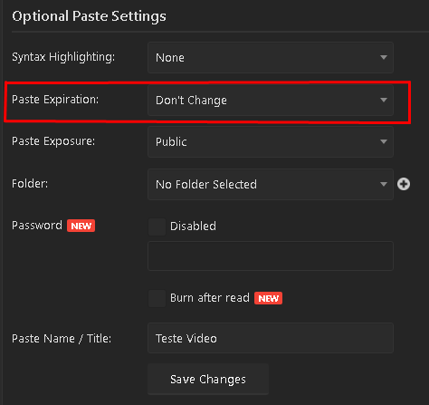
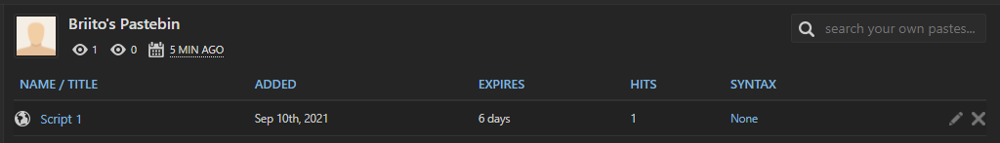
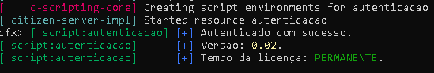

<h1 align='center' >
        <br>Instruções para utilização<br/>
</h1>


### ⌨ Site recomendado: 
 Site que eu recomendo para colocar a autenticacao: https://pastebin.com/


 ### :memo: Licença
Para a licença acabar automaticamente olhe as prints abaixo.


#### Etapa 1
``Aqui você escolhe o tempo que a pasta deve permanecer no ar`` 



#### Etapa 2
``Aqui você consegue visualizar todos os seus scripts/pasta`` 



### 🗄️ Objeto para utilizar nos scripts
```
{
  "license" : "Sua licença",
  "license_time" : "Coloque o tempo da licença",
  "ip2" : "Ip da maquina ou da pessoa que irá rodar",
  "version" : "Versão do arquivo",
  "changelog" : "Changelog que voce quiser",
}
```

### ✅ Tela de sucesso!
``Mensagem de sucesso se der tudo certo!`` 
  


### 🏴 Considerações

``Você deve configurar os webhooks no arquivo config.lua para enviar todos os logs dos scripts para o lugar adequado.`` 

### 🚀 Ajustes futuros!
```Criptografar os scripts e deixar somente a pasta config.lua para ajustes```